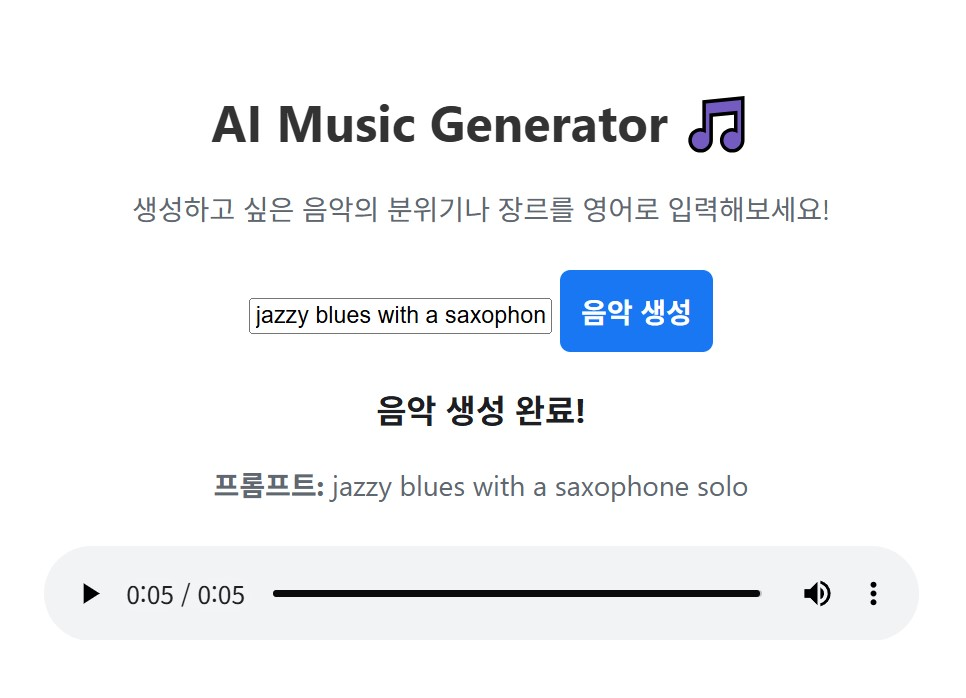

# 🎵 AI Music Generator

텍스트 프롬프트를 입력하면 AI가 세상에 없던 새로운 음악을 생성해주는 웹 애플리케이션입니다.

---

## ✨ 주요 기능

* **비동기 처리:** 음악 생성 요청 시 사용자가 기다릴 필요 없이 즉시 주문을 접수하고, 생성이 완료되면 결과를 화면에 보여주는 비동기 아키텍처를 적용했습니다.
* **클라우드 기반:** 모든 시스템은 Google Firebase(Cloud Functions, Hosting, Firestore) 위에서 동작하여 안정적이고 확장 가능합니다.
* **자동 배포:** GitHub Actions를 이용한 CI/CD 파이프라인을 구축하여, `git push`만으로 모든 변경사항이 자동으로 서버에 배포됩니다.

---

## 🛠️ 기술 스택

* **Frontend:** HTML, CSS, JavaScript
* **Backend:** Python, Firebase Cloud Functions
* **Database:** Firestore
* **AI Model API:** Replicate (riffusion/riffusion)
* **Deployment:** Firebase Hosting, GitHub Actions

---

## 🚀 시작하는 법

1.  이 저장소를 `git clone` 받습니다.
2.  `functions` 폴더 안에서 `pip install -r requirements.txt`로 필요한 라이브러리를 설치합니다.
3.  Firebase 프로젝트를 생성하고, 필요한 인증 키를 설정합니다.
4.  `firebase deploy`를 통해 프로젝트를 배포합니다.

---

## 🧠 배운 점

이 프로젝트를 통해 동기식 처리의 한계를 경험하고, 비동기 시스템 설계의 중요성을 깨달았습니다. 또한, 수많은 클라우드 환경의 에러를 디버깅하며 실제 서비스 수준의 문제 해결 능력을 기를 수 있었습니다.
